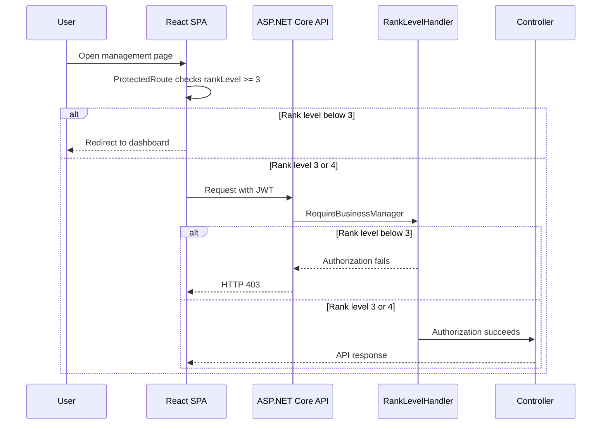

# Business Manager Access Restriction Handoff

**Date:** 2026-09-04
**Scope:** Item Management and User Management only.

## Decision

The user explicitly changed the management access rule:

| Area | Engineer (1) | Manager (2) | Business Manager (3) | Managing Director (4) |
| --- | --- | --- | --- | --- |
| Catalogue browsing | Allowed, subject to item eligibility | Allowed | Allowed | Allowed |
| Inventory | Denied | Allowed | Allowed | Allowed |
| Suppliers | Denied | Allowed | Allowed | Allowed |
| Item Management | Denied | Denied | Allowed | Allowed |
| User Management | Denied | Denied | Allowed | Allowed |

This overrides the earlier Plan baseline that placed Item Management and User Management under the generic Manager+ threshold. It does not change the existing Manager+ access to Inventory, Suppliers, or `GET /api/v1/users/{empNo}/subordinates`.

## Architecture and request flow

The backend remains authoritative. Frontend visibility and route guards improve navigation but cannot grant access.



`RankLevelRequirement` and `RankLevelHandler` remain the single rank-authorization mechanism. Controllers use the named `RequireBusinessManager` policy rather than duplicated role-name checks.

## Backend changes

### Policy registration

`WebApi/Program.cs` registers:

```csharp
.AddPolicy("RequireBusinessManager", policy => policy.Requirements.Add(new RankLevelRequirement(3)))
```

It uses the existing rank mapping:

- Engineer: `1`
- Manager: `2`
- Business Manager: `3`
- Managing Director: `4`

### Protected APIs

`WebApi/Controllers/ManagerCatalogueController.cs` now has class-level:

```csharp
[Authorize(Policy = "RequireBusinessManager")]
```

This protects Item Management APIs:

- `POST /api/v1/items`
- `PUT /api/v1/items/{id}`
- `PATCH /api/v1/items/{id}/deactivate`
- category management APIs in the same controller

`WebApi/Controllers/UsersController.cs` applies `RequireBusinessManager` to:

- `GET /api/v1/users`
- `POST /api/v1/users`
- `PUT /api/v1/users/{empNo}`
- `PATCH /api/v1/users/{empNo}/status`

`GET /api/v1/users/{empNo}/subordinates` remains unchanged. An employee may view their own subordinates; Manager+ may view another employee's subordinates. It is not a User Management API.

## Frontend changes

`frontend/src/routes/ProtectedRoute.jsx` accepts `minimumRankLevel`, defaulting to `1`. The existing `requireManager` prop remains supported, so existing Manager+ routes do not change.

`frontend/src/App.jsx` uses:

```jsx
<Route element={<ProtectedRoute minimumRankLevel={3} />}>
  <Route path="/catalogue/manage" element={<ItemManagement />} />
  <Route path="/user-management" element={<UserManagementPage />} />
</Route>
```

`frontend/src/navigation.js` hides Item Management and User Management below rank `3`. Inventory and Suppliers remain at rank `2`.

## Business Manager row-level restrictions

A controller policy alone only proves the caller is rank 3 or above. `UserManagementService` now applies a second server-side row-level rule before any user mutation:

- A Business Manager may manage Engineer and Manager accounts only.
- A Business Manager cannot update or change the active status of a Business Manager or Managing Director account, including their own account.
- A Business Manager cannot create an account with the Business Manager or Managing Director role.
- A Business Manager cannot change an Engineer or Manager into a Business Manager or Managing Director.
- A Managing Director is not affected by this row-level restriction.

`IUserStore.GetRoleRankLevelAsync` resolves the requested role through ASP.NET Core Identity's `ApplicationRole.RankLevel`; it does not duplicate role-name-to-rank mappings in Application. `GetByEmployeeNumberAsync` provides the target rank. If the rule fails, `UserManagementService` throws `ForbiddenException`; `ExceptionHandlingMiddleware` translates it to RFC 7807 HTTP `403 Forbidden`.

## Tests

Backend integration tests add Business Manager fixtures and verify:

- A Business Manager can list, create, and update Engineer/Manager users.
- A Manager receives `403 Forbidden` from `GET /api/v1/users`.
- A Business Manager receives `403 Forbidden` when creating a Business Manager.
- A Business Manager receives `403 Forbidden` when updating a Business Manager.
- A Business Manager receives `403 Forbidden` when changing a Managing Director's status.
- A Business Manager can create an item.
- A Manager receives `403 Forbidden` from `POST /api/v1/items`.
- An Engineer remains denied item creation.

Frontend route tests verify:

- A Manager at rank `2` is redirected from a Business Manager-only route.
- A rank `3` Business Manager can render the route.

## Validation run

Executed on 2026-09-04:

```sh
dotnet test Project.slnx --no-restore
```

Result: **93 passed, 0 failed**. The build emitted the existing `NU1903` warning for `SQLitePCLRaw.lib.e_sqlite3` 2.1.11.

```sh
cd frontend
npx vitest run src/routes/ProtectedRoute.test.jsx --pool=threads
npm run build
```

Result: **6 passed, 0 failed** and production build succeeded. React Router emitted non-failing future-flag warnings.

## Database and migration impact

None. This changes authorization policies, controllers, client route guards, navigation metadata, and test fixtures only.

## Exclusions

- No change to Inventory or Supplier management access.
- No change to catalogue read access or catalogue rank eligibility filtering.
- No change to the self/subordinate lookup authorization rule.
- No migration, role data change, or new Identity policy/role entity.
- No frontend behavior changed for this row-level rule; the API remains authoritative.

## Reviewer follow-up

Confirm the explicit Business Manager+ override with the team before it is incorporated into the authoritative Plan revision history. Until then, this handoff records the requested behavior and its divergence from the previous Manager+ baseline.
